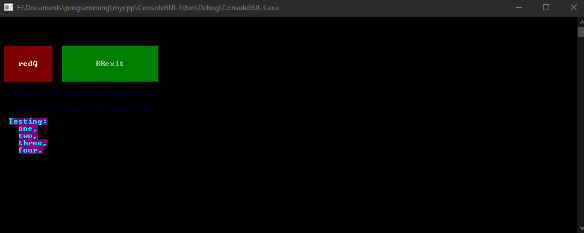
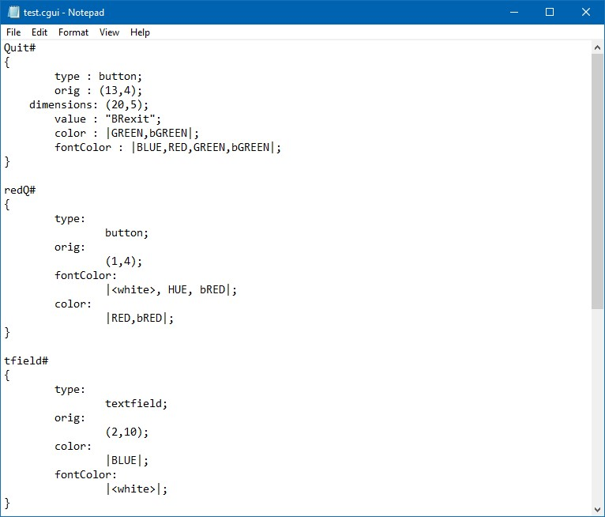

# ConsoleGUI
 ConsoleGUI is a program I made in 2012 that uses the Windows console API to support traditional GUI elements in the console.
 This was my first big C++ project. Unfortunately, it dates back to a time when I did everything I could to ignore source code style conventions. There are also many things I think I would do differently today.

### It includes
 * A markup/style language
 * Support for event-based triggers

### Example

### Markup for the example

